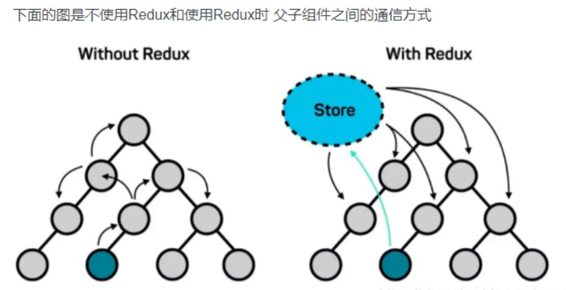
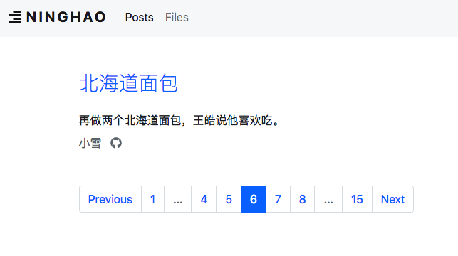
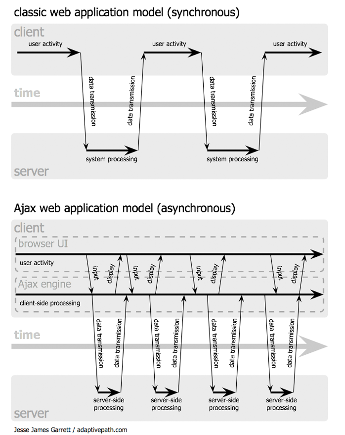

# Redux Guide BYOLIVER

## ***VOCABULARY***

```html
########################################################
reference [ˈref-rəns] vt.引用  n. 参考手册，参照指南；参考书目；介绍信；证明书 
active routes  激活的路由
selected tabs  选定的标签
spinners  加载动效
pagination controls  分页控件,分页器
ever adv. 总是，不断地，在任何时候，在所有时候
ever-changing  adj. 不断变化的
No surprises. 没有什么好奇怪的

###########################################################
mutation  n. 突变,变异
matrix [ˈmeɪtrɪks] n. 矩阵; (细胞)基质；母体；子宫
metal matrix  金属模版
convention n. 惯例，习俗，不成文约定，常规
A is equivalent to B  A等效于B，等价于
assign  分配，指定，指派，赋值，亦可代指拷贝操作
communist n. 共产主义  adj.主产主义的

###########################################################
party n. 政党，党派，帮派
third party  第三方
communist party  共产党
party committee  党派委员会，党委
party member  党派成员，党员
communist party of china n. 中国共产党
coronary[ˈkɒr-nə-ri] adj. 冠状  PS:这类病毒的形状看上去就像古时欧洲统治者的皇冠，因此得名“冠状病毒”。冠状病毒是一类主要引起呼吸道、肠道疾病的病原体。

###########################################################
pay-load  有效载荷（数据帧中的有效数据 ，卫星或航天器携带的仪器设备等）；收费载重（船舶、飞机等的收费运载量，如乘客、货物而不包括燃料）
plain 英 [pleɪn]  adj. 平整的；简单的；朴素的 ； n. 平原；朴实无华之物
arbitrarily [ˌɑːbɪˈtrerəli] adv. 武断的 ，反复无常的
setter n.  一般特指编程语言的 “修改器方法” ， 详见Google
toggle [ˈtɒɡl]  n. 切换器 ; 开关；触发器
trigger 英 [ˈtrɪɡə(r)]n. 扳机（e.g. 手枪的扳机）；事件起因；触发器，引爆装置 v. 触发，引起；开动（装置）
breadcrumb  ['bredkrʌm] n. 指示器, 浏览路径，当前所处位置（e.g.文件管理器），导航栏

##################################################################
版权（Copyright），使用条款（TermsOfUse），
隐私声明（PrivacyStatement），菜单（Menu），
当前位置（Breadcrumb），商标（Logo）

##############################################################
element n. 元素（e.g. 数组元素）
question-mark  即 问号
truthy 即：true
falsy 即：false
formerly adv. 之前，以前
serialize  [ˈsɪəriəlaɪz]  vt.  使序列化
hydrate  [haɪˈdreɪt]   vt.  使注入（到某事物中）

################################################################
debug  v.  调试代码
inspect  v.   在实际场景中测试程序是否正常运行
trivial  [ˈtrɪviəl]  adj. 微不足道的 , 轻而易举的
pagination n. 分页器（正文中会有示例图哦 !!）
fancy adj. 花式的，花俏的，眼花缭乱的
conflate [kənˈfleɪt] vt. 合并，混合 ; 引申为 混淆
p-seudo-code [sju:dəʊˌkəʊd] n. 伪代码

################################################################
entity [ˈen-tə-ti]  n. 实体，存在，本质，代码实例（对象）
normalized  adj. 范式化，规范化，非冗杂的
mutate vt. 修改

pure-function n. 纯洁函数, 纯函数
>QUE : 何谓pure-func?
>ANS :别整花里胡哨的，即： Given the same arguments, it should calculate the next state and return it. No surprises. No side effects. No API calls. No mutations. Just a calculation.

neat [niːt] adj. 巧妙的，灵巧的
trick n. 技巧，捣蛋式恶作剧
boiler n. 锅炉，热水器，烧水壶

####################################################################
boiler-code  n. 样板代码，模板代码
boiler-plate n. 样板
real adj. 严格意义上的
compact adj.  简洁的，紧凑的，极简的
composition n. 成分 ，构成元素
detour [ˈdiːtʊə(r)] n. 迂回路，绕行道路
revolve around 词组，作谓语  意为：在某某四周运转，围绕某某

####################################################################
featured posts 精选文章
unidirectional  adj. 单向的
scheduled interval 词组，做宾语或主语  意为：定时器
A ships with B  A自带B，A附带B
stress  v.  强调，着重声明
Aware of sth  作谓语  意为：直接使用，直接采用
imply  vt.  意味着，暗示

####################################################################
emerge vi. 浮现，体现，暴露，揭露
split vt. 剥离，分解，劈开
brief [briːf] n. 摘要，简报，概要
a-synchronous adj. [eɪˈsɪŋkrənəs] 不同一时间的，非同期的，异步的
demon-strate [ˈdemənstreɪt] n. 证明示例，展示，演示
demo  n.  样板，示例

```


## 00-开发者,初版发行时间; 有什么用,解决了什么痛点; 为什么偏偏选择你,而不是其他的类似的工具


> PS: 规定 统一用如下方式(即 万分计数法 )进行数字表达,  例如  三万六千七百一十  => 3`6710
>
> PPS: 去踏马的 "千分计数法", 老子早都不耐烦了 , 一帮煞笔外国佬 , 和中国国内部分追捧这种反文化和反惯性的舔狗们 , 特别是部分国家统计局的煞笔们 ,  沃柑雷们某!
>
> PPPS: 千分计数方案, 可以说很大程度上 是由于 2^10==1024 ~=1000  . 只要计算机的二进制基础不变, 这种千分计数方案就一直有存在的必要 , 特别是对于 "计算机专业 或 相关专业"的人们!  但是，BUT, 纳尼, 尼玛的国内的搞税务统计的 搞文学的 搞编辑的 都尼玛用这种千分计数方案 , 贱不贱呢你们?  糙泥马! 舔狗去屎!
>
> 
>
> PPPPS:
>
> > 1.English 的换行取决于空格(即 Space )和连字符(英文 Hypen, 形如"-")；
> >
> > 2.汉语随时都可以换行
>
> 
>
> PPPPPS:文档结构符号约定 从左至右 优先级从高到低为  01-, 1#, 1>, (1), 1)   共计5级


### 1#开发者,初版发行时间

由Dan Abramov和Andrew Clark创建

初版发行于2015年

> Redux是由Facebook的Flux演变而来，并受到了编程语言Elm的启发。 
> 截至2017年6月，Redux在Github上的Star数量为5`2700+	. 


---


Redux 是 PC-WebAPP 的 进行状态管理的开源 JavaScript库 。

它最常与React或Angular之类的库一起使用来构建 "PC-WebAPP的 UI部分" 。 

Redux是一个小型库，具有简单，有限的API，旨在作为 PC-WebApp 的 可预测的状态容器。它允许你自由传输并处理 component 的state，允许父子关系与非父子关系的 component 之间传递 state 值。

> A Predictable State Container for JS Apps


### 2#有什么用,解决了什么痛点?

 

> blog.csdn.net/moshowgame/article/details/93979570

`没有使用Redux`的情况，如果`两个组件`之间需要通信的话，可能需要多个中间组件为他们进行消息传递，这样既浪费了资源，代码也会比较复杂。

 

### 3#为什么偏偏选择你,而不是其他的类似的工具

我们知道在一个 React 项目中，一般会定义许许多多的组件，每个组件都有自己的 `State`，通常情况下会通过 `setState` 去更改组件状态或者响应用户的在 UI 上的输入，但是随着一个 App 的内容的增加以及逻辑复杂度的上升，组件的的状态会变得越来越臃肿，继而变得难以维护（维护困难也是 React 最大的痛点）。所以，这个时候就该 Redux 出场了，我们通过引入它来帮助我们**管理组件的状态**。

简单来说，有了 Redux 之后，我们基本上就不需要自己去 `setState` 了，因为几乎所有的 State 的变化都可以交给 Redux 来管理。

> jianshu.com/p/6f95bf723301


---


React-Redux 是 Redux 官方推荐的框架


## 01-知识预热

> 就是几篇Blog而已, 当做爽文即可 , 不需要你动脑子 ... ...
>
> 是的 , 在这个环节暂时不需要你深入思考,但要求你仔细的仔细的仔细的去看文章!!!

### 1#Thanks AJIEW

> jianshu.com/p/6f95bf723301
>
> 鉴于React 和 ReactNative(简写为 RN) 二者之间的 特殊联系 , ***下文中的RN均可以等价理解为React***


#### 1>若干概念

Redux 中的这4个概念是需要我们掌握的，分别是 `Action`, `Reducer`, `Store`, `Dispatch`. 

项目中，一般会定义许多组件，每个组件都有自己的 `State`，通常情况下会通过 `setState` 去更改组件状态或者响应用户的在 UI 上的输入，但是随着一个 App 的内容的增加以及逻辑复杂度的上升，组件的的状态会变得越来越臃肿，继而变得难以维护。

Redux可以帮助我们 管理 component 的 State. 简单来说，有了 Redux 之后，我们基本上就不需要自己去 `setState` 了，因为几乎所有 涉及 State 的操作 都可以交由 Redux 来执行。

 

---


需要改变 State 的 component 需要执行发出 Action 的 Dispatch (即 发送)操作 ，然后 Reducer 根据当前component所持有的State 并结合 刚刚传入的 Action 进行处理 ,最终返回一个new_state ( 即 新的State ) 给Store 。 

> State 保存在 Store 的 State-Tree 中


---

文字太枯燥，来看下面这张图辅助理解：


 


上图是一个非常经典的 "Redux Data Flow" 示意图

1st. React工程 的 component 绑定了 Redux 之后，component 就可以调用 `store.dispatch()` 去发射 action 了（比如基于 button 的点击事件 来发送 action）

2nd. store 接收到 action 之后，会把 "已有的 state"(我的理解是，每个component都具备初始状态的state值 ) 连同 action 二者作为参数  传递给 reducer ；然后 reducer 会根据开发者 所定义 的 逻辑流程 去处理 接受到的参数 ，然后返回  new_state 给 store 

3rd. store 会把  new_state 返回给 发射action的 component.  至此，UI完成了一次更新变幻。


---


Reducer 是如何更改 state 的 ？

```javascript
function textReducer(state = {}, action) {
  let text = action.text;
  let color = action.color;
  // 判断 action 类型
  switch (action.type) {
    case CHANGE_TEXT:
      // 返回新状态
      return Object.assign(
      	{}, 
            state, 
           {text: '新文字：' + text, color: color}，
      );
    default:
      return state;
  }
}

//Object.assign() 冗长的写法会迅速降低 reducer 的可读性。一个可行的替代方案是使用最近加入 JavaScript 规范的 对象展开运算符。对象展开运算符让你可以通过展开运算符 (...) , 以更加简洁的形式将一个对象的可枚举属性拷贝至另一个对象。当你在组合复杂对象时, 使用对象展开运算符带来的好处将更加突出。
//我们试着用这种方式简化 textReducer

function textReducer(state = {}, action) {
  let text = action.text;
  let color = action.color;
  // 判断 action 类型
  switch (action.type) {
    case CHANGE_TEXT:
      // 返回新状态
      return {
        		...state, 
        		{text:'新文字'+text,color:color,}
             }
    default:
      return state;
  }
}

```

Redux语法规定，reducer 中不可以改变原来的 state，也就是要保持 `Object.assign()` 中的第一个参数为NULL，详见L9处代码。

> 不直接修改 state 亦是 Redux 的核心理念 


----


**问：**React工程的 component 是如何更新的？

**答：**当把所有的 state 都交给 Redux 之后，Redux 在 store 中就保存了PC-WebAPP所有的 state ，这意味着我们可以在任意位置获取到这些 state。
在 React 工程中，我们通过 React-Redux 来连接 Redux 和 component，然后在组件中通过将 state 映射成 props 来使用。也就是说，借助 `this.props.xxx` 就可以完成以下三种

>  数据的展示,
>
> 响应用户输入,
>
> UI 的变幻。

 

---

#### 2>API简介

了解了 Redux 基本概念之后就可以来学习一下如何使用了。

之前举了个 Action Creator 和 reducer 的例子，也知道了我们需要通过 store 来将这两者绑定在一起，但是 store 究竟还有哪些作用呢？store 主要有以下职责：

- 保存应用状态（state）
- 提供对 state 的访问：[getState()](https://links.jianshu.com/go?to=https%3A%2F%2Fredux.js.org%2Fapi%2Fstore%23getState) 
- 提供对状态进行更新的方法： [dispatch(action)](https://links.jianshu.com/go?to=https%3A%2F%2Fredux.js.org%2Fapi%2Fstore%23dispatch) 
- 注册监听器： [subscribe(listener)](https://links.jianshu.com/go?to=https%3A%2F%2Fredux.js.org%2Fapi%2Fstore%23subscribe) 
- 借助  [subscribe(listener)](https://links.jianshu.com/go?to=https%3A%2F%2Fredux.js.org%2Fapi%2Fstore%23subscribe) 的"return方法" 来理解 "注册监听器"

可以看出 store 就像**母体**一样，即保存了状态又连接了 Action Creator 和 reducer。但是究竟是怎么连接的呢？

*首先，之前说过我们的 reducer 可以定义 store 保存的 state 树结构，为什么呢？因为 reducer 是可以层层组合的。通常一个组件会有很多层级以及类型（比如 UI 和数据）的 state，我们不可能全都把他们定义在一个 reducer 里，这样代码会变得又长又难以维护。**正确的做法是我们应该把一个 reducer [拆分成多个 reducer](https://links.jianshu.com/go?to=https%3A%2F%2Fredux.js.org%2Fbasics%2Freducers%23splitting-reducers) 后再通过某种方式将它们组合起来。***


---


最常见的就是使用 [combineReducers()](https://links.jianshu.com/go?to=https%3A%2F%2Fredux.js.org%2Fapi%2Fcombinereducers) 方法来组合 reducer，它可以把多个 reducer 合并成一个 reducer 对象(下方所列代码中具体呈现为"伪reducer字典对象")，而合并后的 reducer 的层级结构就是我们访问 state 时的层级结构。
接收参数是 "伪reducer字典对象"，可以自己指定key，也可以直接组合，比如：

```ts
const allReducers = combineReducers(
  {  //伪字典对象
    textReducer,  // "直接组合",也就是仅指定"key"
    imageReducer,  //"直接组合",也就是仅指定"key"
    videoRed: videoReducer, //"指定key-value"
  });
```


> 对combineReducers()函数的更多介绍
> 节选自redux.js.org/api/combinereducers

As your app grows more complex, you'll want to split your [reducing function](https://redux.js.org/glossary#reducer) into separate functions, each managing independent parts of the [state](https://redux.js.org/glossary#state).

The `combineReducers` helper function turns an object whose values are different reducing functions into a single reducing function which you can pass to [`createStore`](https://redux.js.org/api/createstore).

The resulting reducer calls every child reducer, and gathers their results into a single state object. **The state produced by combineReducers() namespaces the states of each reducer under their keys as passed to combineReducers()**

Example:

```js
rootReducer = combineReducers({potato: potatoReducer, tomato: tomatoReducer})
// This would produce the following state object
{
  potato: {
    // ... potatoes, and other state managed by the potatoReducer ...
  },
  tomato: {
    // ... tomatoes, and other state managed by the tomatoReducer, maybe some nice sauce? ...
  }
}
```

You can control state key names by using different keys for the reducers in the passed object. For example, you may call `combineReducers({ todos: myTodosReducer, counter: myCounterReducer })` for the state shape to be `{ todos, counter }`. PS：也就是前文所述的"伪reducer字典对象" .

A popular convention is to name reducers after the state slices they manage, so you can use ES6 property shorthand notation: `combineReducers({ counter, todos })`. This is equivalent to writing `combineReducers({ counter: counter, todos: todos })`.

> 译文：一种流行的不成文约定是在reducer所管理的 state-slices 后命名，也就是说您可以使用ES6属性的简写形式：
>
> ```json
> combinedReducers（{counter，todos}） 
> //这等效于编写
> CombineReducers（{counter：counter，todos：todos}）。
> ```


---


当把多个 reducer 合并成一个之后，我们就可以通过 [createStore](https://links.jianshu.com/go?to=https%3A%2F%2Fredux.js.org%2Fapi%2Fcreatestore) 来创建 store 了，它唯一必须的参数是 reducer，也就是 `combineReducers(reducers)` 所返回的 reducer。

第二个参数是可选的初始状态 `preloadedState`。我们可以从服务器读取初始状态，或者在 app 启动时从本地数据读取初始状态。

第三个参数也是可选的 `enhancer`，接收的是一个函数，可以是你想要提供的第三方的功能，比如 Redux 自带的 applyMiddleware()

```ts
const allReducers = combineReducers({textReducer});

let store = createStore(allReducers, applyMiddleware(thunkMiddleware));
//createStore() 返回的 store 就是保存了应用全局 state 的对象了，这个时候我们就可以使用 getState() 并且根据 reducer 的层级来访问保存在其中的 state 了！

export default store;
```

 

### 2#Thanks GIANTS

> juejin.im/post/5bac26ad6fb9a05d353c8040

#### 1>若干概念

***Redux特性 简介如下***


单一数据源： 整个应用的 state 被储存在一棵 object tree 中，并且这个 object tree 只存在于唯一的sto-re中。


State 是只读的：唯一改变 state 的方法就是触发 action，action 是一个用于描述已发生事件的普通对象。


使用纯函数来执行修改：为了描述 action 如何改变 state tree ，你需要编写 reducers。


预见性：所有的用户的行为都是你提前编写好的。


统一管理state：所有的状态都在且只在一个store中分配管理。


---


redux能帮我们做什么

两张图示意：


---


哪些开发者和项目适合用redux

这里只针对`react native`开发而言：

- 初级：刚接触`react native`我非常不建议去使用，因为你还不知道怎么用它，建议先达到中级。

- 中级：使用`react native`做出一个以上已经上架的`不复杂`的应用 `redux`，也可以不使用，因为使用它并不能让你在前期快速的迭代开发，在这样的项目下使用`redux`就好比`大炮打蚊子`，副作用很大。但是可以先了解起来，并发现它的优点。这类相对简单的应用：当用户触发一个动作（程序需要`setState({xxx:xxx})`)的时候应用程序状态流程是这样的： 

  

  

- 高级：使用`react native`做出一个以上已经上架的`复杂`的应用(涉及到即时通讯、界面布局比较复杂，组件嵌套太多层次等)，而这类复杂应用：当用户触发一个动作（程序需要`setState({xxx:xxx})`)的时候应用程序状态流程是这样的： 

  

  

这种状态带来的后果，两方面分析：

- 性能：祖父子组件之间多余的状态传递，导致宝贵的内存资源浪费，同时界面渲染的速度也会变慢，自然用户体验就变差了。
- 状态管理：当程序不断的迭代，界面布局越来越复杂，必然就会产生许多的`state`状态，那你是如何有效的管理这些状态？是什么原因导致UI多次渲染？是哪一步操作导致的UI组件的变化？在没有使用`redux`前你可能已经发现可以使用生命周期函数中的`shouldComponentUpdate`来减少子组件中没必要的渲染，但终究解决不了状态管理复杂的难题。 当你使用`redux`后，复杂的应用程序状态流程是这样的：

 

 

 

---


redux for react native 工作逻辑图

感谢@[黑森林工作室](https://www.jianshu.com/u/8b645668c3c4)作者提供的清晰的逻辑图


PS：注意比较其他的几张图，对初学的自学者而言 持怀疑谨慎的态度总归是好的。。。


---


需要注意的事

- 一个工程中 `redux` 的 `store` 是唯一的，即 不能同时存在多个 `store`  。

- 保持 `reducer` 纯净非常重要。永远不要在 `reducer` 里做这些操作：

  > ***永远不要*** 在 `reducer` 里做这些操作:
  >
  > ​	修改传入参数；
  >
  > ​	执行有副作用的操作，如 `API` 请求和路由跳转；
  >
  > ​	调用非纯洁函数，如 `Date.now()` 或 `Math.random()`;


- 使用 "对象展开运算符"`...`代替`Object.assign()` 无疑是更好的编码习惯

  > 对象展开运算符（Object Spread Operator）简介：
  >
  > 它让你以更加简洁的形式将一个对象的可枚举属性复制到另一个对象。对象展开运算符在概念上与 ES6 的 [数组展开运算符](https://developer.mozilla.org/en-US/docs/Web/JavaScript/Reference/Operators/Spread_operator) 相似。
  > 另参考  cn.redux.js.org/docs/recipes/UsingObjectSpreadOperator.html

- 组件名首字母要大写，也就是说`components`和`containers`文件夹下的文件首字母都要大写。

- 应该尽量减少传递到`action` 中的数据（能传单个数据就不传对象，能传对象就不传数组）

 

---


Middleware（中间固件）的作用

> The main difference between **firmware** and **middleware** is that the **firmware** is a type of software that allows controlling the device's hardware while the **middleware** is a software that provides services to software applications beyond those available from the operating system. 
>
> 参考网址 ：pediaa.com/difference-between-firmware-and-middleware/


`Middleware`是在`Actions`和`Dispatcher`之间被嵌入的为了解决某些问题、提高我们开发效率而存在的工具。 下面介绍三种常用的中间件：

- [redux-thunk](https://github.com/reduxjs/redux-thunk) 中间件：项目中的异步操作需要用到（例如：请求服务器数据、本地存储等）。
- [redux-actions](https://github.com/redux-utilities/redux-actions) 中间件：帮助处理和创建操作`actions`（本文不做介绍，后续项目复杂后可以使用它来创建）。
- [redux-logger](https://github.com/evgenyrodionov/redux-logger) 中间件：用来打印 `action` 日志。 开启`react native`远程调试模式，操作demo就能在控制台看到打印的状态前后变化。


加入中间件后的示意图如下：


 

 

 

 

#### 2>Api 简介

> 略！！！


### 3#Thanks MOSHOW

> blog.csdn.net/moshowgame/article/details/93979570

#### 1>若干概念

什么是Redux？

> 官方解释：Redux is a predictable state container for JavaScript apps. 意思就是Redux是js应用的 一种可预测的状态容器，就是允许你自由传输并处理React项目中 component 的 state ，实现在不同的组件之间传递State


为什么使用Redux?

>  
>
> 
>
> `没有使用Redux`的情况，如果`两个组件`(非父子关系)之间需要通信的话，可能需要多个中间组件为他们进行消息传递，这样既浪费了资源，也会增加代码的复杂度。


Redux的概念

> Redux中提出了单一数据源Store 用来存储state数据，所有的组件都可以通过Action修改Store，也可以从Store中获取最新状态的State。redux帮助开发者更好的解决组件之间的State通信问题。
>
> Reducer: 理解为receiver接收器或者handler处理器，根据接收到的 action+state 向store返回 new_state，
>
> Action: 理解为发送者Sender或者dispatcher分发者，action中一般包含type(必须)和data(可选),action.type就相当于一个主题或者一个标识，方便在reducer中根据不同的type进行不同的处理，一般react.component中主动调起dispatch(action)分发请求之后，Reducer才会进行下一步的处理
>
> Store: 创建store，用于存储state数据，进行state的传输，理解为一个全局通用的state仓库或者state工厂。
> 


#### 2>API简介

> 略


### 4#Thanks Chad

> juejin.im/post/5cc1ace96fb9a0321728245e

 

#### 1>若干概念

​	2014年 Facebook 提出了 Flux 架构的概念，引发了很多的实现。2015年，Redux 出现，将 Flux 与函数式编程结合一起，短时间内就成为热门的前端工具。 

​	首先明确一点，Redux 是一个有用的架构，但不是非用不可。事实上，大多数情况，你可以不用它，只用 React 就够了。 曾经有人说过这样一句话。 `"如果你不知道是否需要 Redux，那就是不需要它。"`    	—— Redux 的发布者 Dan Abramov

> 简单说，如果你的UI层非常简单，没有很多互动，Redux 就是不必要的，用了反而增加复杂性。 
>
> 
>
> 如何理解“UI层非常简单”?
>
> > 用户的使用方式非常简单 
> >
> > 用户之间没有协作 
> >
> > 不需要与服务器大量交互，
> >
> > 没有使用 WebSocket 视图层（View）
> >
> > 只从单一来源获取数据 


#### 2>API简介	

##### Store

Store 就是保存数据的地方，你可以把它看成一个容器。整个应用只能有一个 Store。 Redux 提供createStore这个函数，用来生成 Store。

```ts
//test.js

import { createStore } from 'redux';
const store = createStore(fn);  //形参fn 的实际含义，参考下文
                                //由于是节选自博客，难免有缺陷，详见APIDocs
					   //这玩意儿，在当前章节无需深入，就是看个热闹而已！
```

##### Action

State 的变化，会导致 View 的变化。但是，用户使用过程中只能与 View进行交互。所以，State 的变化必须是 View 导致的。

至于Action， 则是 View 发出的通知，表示 State 将要发生变化。

> Action是一个对象。
>
> Action 必须定义type属性，表示 Action 的名称。
> 其他属性可以自由设置，详情可以参考社区规范。

```
//test.js

const action = {
  type: 'ADD_TODO',
  payload: 'Learn Redux'
};

```

上面代码中，Action 的名称是ADD_TODO，有效载荷为 "Learn Redux"。 可以这样理解，Action 描述当前发生的事情。

改变 State 的唯一办法，就是使用 Action。它会运送  ”特定数据“  到 Store。

##### Action Creator

View 要发送多少种数据，就会有多少种 Action。如果都手写，会很麻烦。可以定义一个函数来生成 Action，这个函数就叫 Action Creator。

```
// test.js

const ADD_TODO = '添加 TODO';

function addTodo(argsYourInput) {
  return {
    type: ADD_TODO,
    argsYourInput,  //ps: 这里并未严格遵守键值对的格式 
  }
}

```

const action = addTodo('Learn Redux'); 上面代码中，addTodo函数就是一个 Action Creator。

##### store.dispatch()

store.dispatch()是 View 发出 Action 的唯一方法。

```
//test.js

import { createStore } from 'redux';
const store = createStore(fn); //注意形参 fn

store.dispatch({ // 可知，store.dispatch()应当接受 Action 型参数
  type: 'ADD_TODO',
  payload: 'Learn Redux'，
});
复制代码
```

上面代码中，store.dispatch接受一个 Action 对象作为参数，将它发送出去。 结合 Action Creator，这段代码可以改写如下。

`store.dispatch(addTodo('Learn Redux'));`

##### Reducer

Reducer 是一个函数，它接受 Action 和  已有的State 作为参数，返回一个新的  new_state。

> Store 收到 Action 以后，必须给出一个新的 State，这样 View 才会发生变化。

```
//test.js

const reducer = function (state, action) {  //当前已有的 State, 被传入的Action
  // ...
  return new_state;
};
复制代码
```

整个 WebPCApp 的初始状态，就是 State 的默认值。下面是一个实际的例子。

```
//test.js

const defaultState = 0;
const reducer = (state = defaultState, action) => {
  switch (action.type) {
    case 'ADD':
      return state + action.payload;  //生成一个 new_state
    default: 
      return state;  // state原值返回
  }
};

const new_state = reducer(1, {
  type: 'ADD',
  payload: 2
});

复制代码
```

上面代码中，reducer函数收到名为ADD的 Action 以后，就返回一个 new_state，作为加法的计算结果。其他运算的逻辑（比如减法），也可以根据 Action 的不同来实现。

实际应用中，Reducer 函数不用像上面这样手动调用，store.dispatch方法会触发 Reducer 的自动执行。为此，Store 需要知道 Reducer 函数，做法就是在生成 Store 的时候，将 Reducer 传入createStore方法。

```
//test.js

import { createStore } from 'redux';
const store = createStore(reducer);  // 形参类型 具体为 “Reducer”函数 ，即所谓							  // 的 "fn"

```

上面代码中，createStore接受 Reducer 作为参数，生成一个新的 Store。以后每当store.dispatch发送过来一个新的 Action，就会自动调用 Reducer，得到  new_state。


---


为什么这个函数被命名为  "Reducer" 呢？因为它可以作为 {array}.reduce  函数的参数。

请看下面的例子，若干个 Action 对象 构成了 一个数组。		

```ts
//test.js
const actions = [
  { type: 'ADD01', payload: 0 },
  { type: 'ADD02', payload: 1 },
  { type: 'ADD03', payload: 2 }
];

const total = actions.reduce(reducer, 0); //上面代码中，数组actions表示依次有三个 Action，分别是 "01, 02, 03"。数组的reduce方法接受 reducer 函数作为参数，ADD03 就是 最终所得到的 state 值。

```


##### store.subscribe()

Store 允许使用store.subscribe方法设置监听函数，一旦 State 发生变化，就自动执行这个函数。

```ts
//test.js

import { createStore } from 'redux';
const store = createStore(reducer); //为何传入 reducer作为实参？
store.subscribe(listener);  //这里是伪代码，故而漏洞百出，无需深究

///形参fn 的实际含义，参考下文
//由于是节选自博客，难免有缺陷，详见APIDocs
//这玩意儿，在当前章节无需深入，就是看个热闹而已
```

> 详见APIDocs

 

 

## 02-核心概念 Core Concepts 

### 1#基础概念

Imagine your app’s state is described as a plain object. For example, the state of a todo app might look like this:

```js
//为了便于说明，我们写出如下的示例代码 以 用来表示 state
{
  todos: [   //名为 todos 的State ， 且呈现为 数组
    {text: 'Eat food',completed: true}, //第一个元素
    {text: 'Exercise',completed: false}，//第二个元素
  ],
  
  visibilityFilter: 'SHOW_COMPLETED'  //名为 visibilityFilter 的State
}
```

This object is like a “model” except that there are no setters. This is so that different parts of the code can’t change the state arbitrarily, causing hard-to-reproduce bugs.


---


To change something in the state, you need to dispatch an action. 

An action is a plain JavaScript object (notice how we don’t introduce any magic?) that describes what happened.

> 如何理解 "plain JS object 即 普通型JS对象 "?
>
> 也就是说，我们无需 ”复杂的函数自定义过程“ ，也无需"借助第三方Library去构造一个全新对象"


Here are a few example actions:

```ts
{ type: 'ADD_TODO', text: 'Go to swimming pool' }
{ type: 'TOGGLE_TODO', index: 1 }
{ type: 'SET_VISIBILITY_FILTER', filter: 'SHOW_ALL' } //允许非严格的键值对形式
```


---


Enforcing that every change is described as an action lets us have a clear understanding of what’s going on in the app. If something changed, we know why it changed. Actions are like breadcrumbs of what has happened. Finally, to tie state and actions together, we write a function called a reducer. Again, nothing magical about it—it’s just a function that takes state and action as arguments, and returns the next state of the app. It would be hard to write such a function for a big app, so we write smaller functions which managing parts of the state:

> 很显然，为一个庞大的 PC-WebAPP编写 单独的一个Reducer型函数，是很困难的。
>
> 一个较好的解决策略就是，我们为 "特定的State+对应的Action"  编写 "特定的Reducer"

```ts
//test.js   承接上述代码
//Reducer型 函数自定义示例 , 承接上述策略， 此处定义了两个 reducer函数

//传入参数类型为 State 和 Action 即可， 函数名则可以自由定义
function visibilityFilter(state = 'SHOW_ALL', action) {
  if (action.type === 'SET_VISIBILITY_FILTER') {//见上一个代码块 L3
    return action.filter
  } else {
    return state
  }
}

//传入参数类型为 State 和 Action 即可， 函数名则可以自由定义
function todos(state = [], action) {
  switch (action.type) { 
    case 'ADD_TODO': //case处 允许 直接匹配 键值对中的 "值"
      return state.concat([{ text: action.text, completed: false }])
    case 'TOGGLE_TODO': //case处 允许 直接匹配 键值对中的 "值"
      return state.map((todo, index) =>   //箭头函数，传入了 2 个实参！
	//state.map函数，解构了"todos"数组 ，得到了 "todo"
////////////////////////////////////////////////////
	  //JS的 “条件运算符” 语法                       
        action.index === index  //index 参见上一个代码块 L2
          ? { text: todo.text, completed: !todo.completed }
          : todo 
                       
       ） //箭头函数止于此
////////////////////////////////////////////////////                  
      default:
      	return state
  }
}
```

> **条件运算符**是 JavaScript 仅有的使用三个操作数的运算符。本运算符经常作为 `if` 语句的简捷形式来使用。
>
> 一个条件后面会跟一个问号（?），表达式A后面跟着一个冒号（:）
>
> 如果条件为 [truthy](https://developer.mozilla.org/zh-CN/docs/Glossary/Truthy) ，则问号后面的表达式A将会执行； 如果条件为 [falsy](https://developer.mozilla.org/zh-CN/docs/Glossary/Falsy) ，则冒号后面的表达式B将会执行。
>
> truthy 即：true
> falsy 即：false


更多知识 关于 “条件运算符”

> 节选自如下网址 `developer.mozilla.org/zh_CN/docs/Web/JavaScript/Reference/Operators/Conditional_Operator`
>
> #### 语法
>
> ```js
> condition ? exprIfTrue : exprIfFalse
> ```
>
> #### 参数
>
> - `condition`
>
>   计算结果用作条件的表达式
>
> - `exprIfTrue`
>
>   如果表达式 `condition` 的计算结果是 [truthy](https://developer.mozilla.org/zh-CN/docs/Glossary/Truthy)（它和 `true` 相等或者可以转换成 `true`），那么表达式 `exprIfTrue` 将会被求值。
>
> - `exprIfFalse`
>
>   如果表达式 `condition` 的计算结果是 [falsy](https://developer.mozilla.org/zh-CN/docs/Glossary/Falsy)（它可以转换成 `false` ），那么表达式 `exprIfFalse` 将会被执行。


---


And we write another reducer that manages the complete state of our app by calling those two reducers for the corresponding state keys:

```
function todoApp(state = {}, action) {
  return {
    todos: todos(state.todos, action),
    visibilityFilter: visibilityFilter(state.visibilityFilter, action)
  }
}
```

This is basically the whole idea of Redux. Note that we haven’t used any Redux APIs. It comes with a few utilities to facilitate this pattern, but the main idea is that you describe how your state is updated over time in response to action objects, and 90% of the code you write is just plain JavaScript, with no use of Redux itself, its APIs, or any magic.

> 这差不多就是 Redux 思想的全部。注意到没我们还没有使用任何 Redux 的 API。Redux 里有一些工具来简化这种模式，但是主要的想法是如何根据这些 action 对象来更新 state，而且 90% 的代码都是纯 JavaScript，没用 Redux、Redux API 和其它魔法。


### 2#三大原则

Redux can be described in three fundamental principles:

​	Single source of truth	 （单一数据源）

​	State is read-only	（State 是只读的）

​	Changes are made with pure functions	  （使用纯函数来执行修改）


---


#### 1>如何理解 "Single source of truth"

**The state of your whole application is stored in an object-tree within a single store.**

This makes it easy to create universal apps, as the state from your server can be serialized and hydrated into the client with no extra coding effort. A single state tree also makes it easier to debug or inspect an application; it also enables you to persist your app's state in development, for a faster development cycle. Some functionality which has been traditionally difficult to implement - Undo/Redo, for example - can suddenly become trivial to implement, if all of your state is stored in a single tree.

>参考译文（仅供参考）：
>Universal-App (即 同构应用) 是指写一份代码但可同时在浏览器和服务器中运行的应用。	
>serialize  [ˈsɪəriəlaɪz]  vt.  使序列化
>hydrate  [haɪˈdreɪt]   vt.  使注入（到某事物中）
>debug  v. 调试代码
>inspect  v. 在实际场景中测试程序各项功能是否正常
>persist  [pəˈsɪst]   vt.  保留（至本地），保存（至本地）
>trivial  [ˈtrɪviəl]  adj. 微不足道的 , 轻而易举的


```js
console.log(store.getState())

/* Prints  即 此处打印了所有的State ，印证了 单一的数据源
{
  visibilityFilter: 'SHOW_ALL',
  todos: [
    {
      text: 'Consider using Redux',
      completed: true,
    },
    {
      text: 'Keep all state in a single tree',
      completed: false
    }
  ]
}
*/
```


#### 2>如何理解 "State is read-only"？

**唯一改变 state 的方法就是触发 action，action 是一个用于描述已发生事件的普通对象。**

> 这句话的意思是 ： 想要改变State, 需要通过store.dispatch（）成功触发action ，才能实现！

这样确保了视图和网络请求都不能直接修改 state，相反它们只能表达想要修改的意图。因为所有的修改都被集中化处理，且严格按照一个接一个的顺序执行，因此不用担心 race condition 的出现。 Action 就是普通对象而已，因此它们可以被日志打印、序列化、储存、后期调试或测试时重现出来。

> 参考译文：
>
> race conditions   竞争条件

```js
//唯一改变 state 的方法就是触发 action 
//想要改变State, 需要通过store.dispatch（）成功触发action ，才能实现！

store.dispatch(
  {   //触发代码 示例
  type: 'COMPLETE_TODO', //可见，此处传入的实参为 action对象
  index: 1
  }
)


store.dispatch({   //触发代码 示例
  type: 'SET_VISIBILITY_FILTER', //亦传入了一个action对象
  filter: 'SHOW_COMPLETED'
})
```


#### 3>如何理解 "Changes are made with pure functions"？

**为了描述 action 如何改变 state tree ，你需要编写 reducers。**

Reducers 只是一系列单纯的函数，它接收  old_state 和 action，并返回 new_state。刚开始你可以只有一个 reducer，随着应用变大，你可以把它拆分成多个小型 "Reducer"，分别独立地操作 state-tree 的不同部分.

因为 reducer 只是纯函数，你可以控制它们被调用的顺序，传入附加数据，甚至编写可复用的 reducer 来处理一些通用任务，如分页器


> 英文原文：
>
> **To specify how the state tree is transformed by actions, you write pure reducers.**
>
> Reducers are just pure functions that take the previous state and an action, and return the next state. Remember to return new state objects, instead of mutating the previous state. You can start with a single reducer, and as your app grows, split it off into smaller reducers that manage specific parts of the state tree. 
>
> Because reducers are just functions, you can control the order in which they are called, pass additional data, or even make reusable reducers for common tasks such as pagination.。


---

##### 分页器示例图





---


##### 你一定要看完一定要看完一定要看完下面的代码，就应该明白 Redux 是怎么回事了！！！！

> ***此处先温习部分先前的知识点***
>
> 
>
> 使用 "对象展开运算符"`...`代替`Object.assign()` 无疑是更好的编码习惯
>
> > 对象展开运算符（Object Spread Operator）简介：
> >
> > 它让你以更加简洁的形式将一个对象的可枚举属性复制到另一个对象。对象展开运算符在概念上与 ES6 的 [数组展开运算符](https://developer.mozilla.org/en-US/docs/Web/JavaScript/Reference/Operators/Spread_operator) 相似。
> > 另参考  cn.redux.js.org/docs/recipes/UsingObjectSpreadOperator.html


```js
//test.js

//分别独立地操作 state-tree 的不同部分.
import { combineReducers, createStore } from 'redux'

function visibilityFilter(state = 'SHOW_ALL', action) {
  switch (action.type) {
    case 'SET_VISIBILITY_FILTER':
      return action.filter
    default:
      return state
  }
}

//分别独立地操作 state-tree 的不同部分.
function todos(state = [], action) {
  switch (action.type) {
    //case01
    case 'ADD_TODO':
      return [
        ...state,  //对象展开运算符
        {
          text: action.text,
          completed: false
        }
      ]
    //case02  
    case 'COMPLETE_TODO':
      return state.map((todo, index) => {
        if (index === action.index)  
/////////////////////////////////////////////////////////
        {
          return Object.assign(
            	{}, 
            	todo, 
            	{ completed: true }，
          )
     
        }          
/////////////////////////////////////////////////////////
          //上述L32~L39可优化为：
          
          	return{
            	...todo,
            	{completed:true},
          	}
     
          else
        	return todo
      })
    //case00
    default:
      return state
      
  }
}

//通过combine操作，形成了一个 完全体reducer函数
let reducer = combineReducers({ visibilityFilter, todos }) 
let store = createStore(reducer) //实参为 Reducers型函数
```


### 3#诞生于Redux 之前的技术

Redux 是一个混合产物。它和一些设计模式及技术相似，但也有不同之处。让我们来探索一下这些相似与不同。

> 参考详情：redux.org.cn/docs/introduction/PriorArt.html
>
> ### Flux 
>
> ### Elm
>
> ### Immutable
>
> ### Baobab
>
> ### Rx


### 4#Learning Resources （工程上手+知识深入）

 https://redux.js.org/introduction/learning-resources


### 5#Redux-Ecosystem （Redux的生态系统）

> https://redux.js.org/introduction/ecosystem


### 6#Redux-Examples  (Redux的原生示例)

> https://redux.js.org/introduction/examples


## 03-工程上手+知识深入

### 1#官方API-基础教程示例

> 参考网址
> redux.js.org/basics/basic-tutorial

由于涉及到 上机操作，我的建议是：

​	-代码 及 重要注释 保存在了 工程项目当中

​	-秉持越少越好的原则，我会把自己认为的重要的、易混淆的知识点， 记录在此MD文档中


---


##### Action对象  的代码构造形式：（即：数据结构形式是怎样的？是否有键值对？ etc.）

Actions are plain JavaScript objects. 

Actions must have a `type` property 

> Type property indicates the type of action being performed. Types should typically be defined as string constants. Once your app is large enough, you may want to move them into a separate module.

Other than `type`, the structure of an action object is really up to you.  

> If you're interested, check out [Flux Standard Action](https://github.com/acdlite/flux-standard-action) for recommendations on how actions could be constructed.

```js
// 伪代码示例 ， 仅用于展示 action的代码结构！！！
//不难发现， 必须定义 "type"属性， 其余属性开发者可以自由发挥！

//参考形式I
const ADD_TODO = 'ADD_TODO'
{
  type: ADD_TODO,
  text: 'Build my first Redux app'
}

// 参考形式II
Copy
{
  type: TOGGLE_TODO,
  index: 5
}

// 参考形式III
Copy
{
  type: TOGGLE_TODO,
  index: 5
}
//不难发现， 必须定义 "type"属性， 其余属性开发者可以自由发挥！
```


---


Now we can rewrite the main reducer as a function that calls the reducers managing parts of the state, and combines them into a single object. It also doesn't need to know the complete initial state any more. It's enough that the child reducers return their initial state when given `undefined` at first. 

**Note that each of these reducers is managing its own part of the global state. The state parameter is different for every reducer, and corresponds to the part of the state it manages.**

This is already looking good! When the app is larger, we can split the reducers into separate files and keep them completely independent and managing different data domains.

```js
//我们希望尽可能 抽离出 每类相互独立的代码块
function todos(state = [], action) {
  switch (action.type) {
    case ADD_TODO:
      return [
        ...state,
        {
          text: action.text,
          completed: false
        }
      ]
    case TOGGLE_TODO:
      return state.map((todo, index) => {
        if (index === action.index) {
          return Object.assign({}, todo, {
            completed: !todo.completed
          })
        }
        return todo
      })
    default:
      return state
  }
}

function visibilityFilter(state = SHOW_ALL, action) {
  switch (action.type) {
    case SET_VISIBILITY_FILTER:
      return action.filter
    default:
      return state
  }
}

//借助于Redux库，我们可以把下面几句代码进一步简化
function todoApp(state = {}, action) {
  return {
    visibilityFilter: visibilityFilter(state.visibilityFilter, action),
    todos: todos(state.todos, action)
  }
}
```

Finally, Redux provides a utility called [`combineReducers()`](https://redux.js.org/api/combinereducers) that does the same boilerplate logic that the `todoApp` above currently does. With its help, we can rewrite `todoApp` like this:

```json
import { combineReducers } from 'redux'
//导入对应的库之后，简化过后的代码如下
const todoApp = combineReducers({
  visibilityFilter,
  todos
})

```


---


In the previous sections, we defined the [actions](https://redux.js.org/basics/actions) that represent the facts about “what happened” and the [reducers](https://redux.js.org/basics/reducers) that update the state according to those actions.

The **Store** is the object that brings them together. The store has the following responsibilities:

- Holds application state;
- Allows access to state via [`getState()`](https://redux.js.org/api/store#getState);
- Allows state to be updated via [`dispatch(action)`](https://redux.js.org/api/store#dispatchaction);
- Registers listeners via [`subscribe(listener)`](https://redux.js.org/api/store#subscribelistener);
- Handles unregistering of listeners via the function returned by [`subscribe(listener)`](https://redux.js.org/api/store#subscribelistener).

It's important to note that you'll only have a single store in a Redux application. When you want to split your data handling logic, you'll use [reducer composition](https://redux.js.org/basics/reducers#splitting-reducers) instead of many stores.

It's easy to create a store if you have a reducer. In the [previous section](https://redux.js.org/basics/reducers), we used [`combineReducers()`](https://redux.js.org/api/combinereducers) to combine several reducers into a single func. We will now import it, and pass it to [`createStore()`](https://redux.js.org/api/createstore).

```json
//pseudoCode 示例
import { createStore } from 'redux'
import todoApp from './reducers'
const store = createStore(todoApp)
```


You may optionally specify the initial state as the second argument to [`createStore()`](https://redux.js.org/api/createstore). This is useful for hydrating the state of the client to match the state of a Redux application running on the server.

```java
const store = createStore(todoApp, window.STATE_FROM_SERVER)
```


---


Redux architecture revolves around a **strict unidirectional data flow**.

##### The data lifecycle in any Redux app follows these 4 steps:

> 1. You call store.dispatch(action).
> 2. The Redux store calls the reducer function you gave it.
> 3. The root reducer may combine the output of multiple reducers into a single state tree.
> 4. The Redux store saves the complete state tree returned by the root reducer.


##### 如何理解"Pure-Function  And Predictable?"

> Note that a reducer is a pure function. It only *computes* the next state. It should be completely predictable: calling it with the same inputs many many times should produce the same outputs. It shouldn't perform any side effects like API calls or router transitions. 


---


From the very beginning, we need to stress that Redux has no relation to React. You can write Redux apps with React, Angular, Ember, jQuery, or vanilla-JavaScript（即：纯js代码）.

That said, Redux works especially well with libraries like [React](http://facebook.github.io/react/) and [Deku](https://github.com/dekujs/deku) because they let you describe UI as a function of state, and Redux emits state updates in response to actions.

We will use React to build our simple todo app, and cover the basics of how to use React with Redux.

> **Note**: see **the official React-Redux docs at https://react-redux.js.org** for a complete guide on how to use Redux and React together.


---


I see the following presentational components and their props emerge from this brief . 

> 参考译文：
>
> 请查看下文的若干展示组件和摘要中体现的若干组件属性
>
> PS: components 和 props  均为复数，故而酌情添加译文词汇 "若干"


---


> https://redux.js.org/basics/usage-with-react#implementing-other-components
>
> @containers/AddTodo.js


# 未完待续

### 2#Thanks  Chad

> juejin.im/post/5cc1ace96fb9a0321728245e  正文第二部分


### 3#官方汇总资源#

>  https://redux.js.org/introduction/learning-resources


### 4#同步与异步 图片示例

> TraditionalWeb_and_AjaxWeb




### 5#Call_then_Back函数

中文名直译为：***调用后再返回函数***

> 或者由于语言习惯，或者故作高深，亦或者出于无条件践行隔行如隔山的自我保护的守则，等等若干原因，常常被翻译为"回调函数"

在计算机程序设计中，Callback是指通过函数参数传递到其它代码的，某一块可执行代码的引用。这一设计允许了底层代码调用在高层定义的子程序。

回调的用途十分广泛。

> 例如，假设有一个函数，其功能为读取配置文件并由文件内容设置对应的选项。若这些选项由[散列值](https://zh.wikipedia.org/wiki/%E6%95%A3%E5%88%97%E5%87%BD%E6%95%B0)所标记，则让这个函数接受一个回调会使得程序设计更加灵活：函数的调用者可以使用所希望的散列算法，该算法由一个将选项名转变为散列值的回调函数实现；因此，回调允许函数调用者在运行时调整原始函数的行为。
>
> 回调的另一种用途在于处理信号或者类似物。例如一个[POSIX](https://zh.wikipedia.org/wiki/POSIX)程序可能在收到[SIGTERM](https://zh.wikipedia.org/wiki/SIGTERM)信号时不愿立即终止；为了保证一切运行良好，该程序可以将清理函数注册为SIGTERM信号对应的回调。
>
> 回调亦可以用于控制一个函数是否作为：[Xlib](https://zh.wikipedia.org/wiki/Xlib)允许自定义的[谓词](https://zh.wikipedia.org/wiki/%E8%B0%93%E8%AF%8D)用于决定程序是否希望处理特定的事件。


---


In computer programming, a callback, also known as a "call-after"[1] function, is any executable co-de that is passed as an argument to other code; that other code is expected to call back (execute) the argument at a given time. This execution may be immediate as in a synchronous callback, or it might happen at a later time as in an asynchronous callback.

> Programming languages support callbacks in different ways, often implementing them with subro-utines, lambda expressions, blocks, or function pointers.

There are two types of callbacks, differing in how they control data flow at runtime: blocking call-backs (also known as synchronous callbacks or just callbacks) and deferred callbacks (also known as asynchronous callbacks). While blocking callbacks are invoked before a function returns (in the C exam-ple below, which illustrates a blocking callback, it is function main), deferred callbacks may be invoked after a function returns. Deferred callbacks are often used in the context of I/O operations or event han-dling, and are called by interrupts or by a different thread in case of multiple threads. Due to their natu-re, bl-ocking callbacks can work without interrupts or multiple threads, meaning that blocking callbacks are not commonly used for synchronization or delegating work to another thread.

> Callbacks are used to program applications in windowing systems. In this case, the application sup-plies (a reference to) a specific custom callback function for the operating system to call, which then calls this application-specific function in response to events like mouse clicks or key presses. A major concern here is the management of privilege and security: whilst the function is called from the operating syste-m, it should not run with the same privilege as the system. A solution to this problem is using rings of p-rotection.